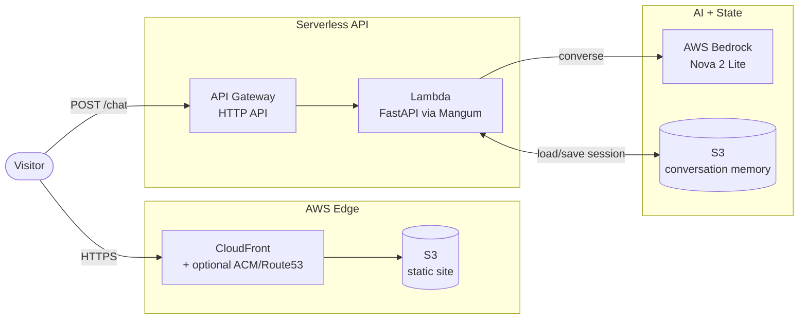

# AI Digital Twin

A production-grade **AI career representative** — a conversational "digital twin" that speaks on behalf of a person, answering questions about their background, skills, and experience as if it were them. The application is fully serverless on AWS, infrastructure is managed with Terraform, and deployments are automated through GitHub Actions.

---

## Overview

The Digital Twin is a chat application backed by a large language model (AWS Bedrock). On each turn, the backend assembles a rich system prompt from the persona's real data — LinkedIn profile, a written summary, communication-style notes, and structured facts — and instructs the model to faithfully represent that person while resisting jailbreaks and staying professional. Conversations are persisted per session so the twin has memory across messages.

**Live flow:** a visitor opens the static site → types a message → the React client `POST`s to the API → API Gateway invokes a Lambda running FastAPI → FastAPI loads the session history, calls Bedrock with the persona system prompt, saves the updated transcript to S3, and returns the reply.

---

## Architecture



| Layer | Technology | Source |
|-------|------------|--------|
| **Frontend** | Next.js 16 (static export), React 19, TypeScript, Tailwind CSS 4 | [frontend/](frontend/) |
| **Backend API** | FastAPI, Pydantic, Mangum (Lambda adapter) | [backend/server.py](backend/server.py) |
| **LLM** | AWS Bedrock — `converse` API, default model Amazon Nova 2 Lite | [backend/server.py:106](backend/server.py#L106) |
| **Persona / Prompt** | System prompt assembled from PDF + text + JSON sources | [backend/context.py](backend/context.py), [backend/resources.py](backend/resources.py) |
| **State / Memory** | S3 (production) or local files (dev), keyed by session id | [backend/server.py:70](backend/server.py#L70) |
| **Infrastructure** | Terraform — Lambda, API Gateway, S3 ×2, CloudFront, IAM, optional ACM + Route53 | [terraform/main.tf](terraform/main.tf) |
| **CI/CD** | GitHub Actions with OIDC role assumption | [.github/workflows/deploy.yml](.github/workflows/deploy.yml) |

---

## Key Features

- **Persona-driven prompting** — the system prompt is generated at request time from the person's LinkedIn PDF, summary, style guide, and facts, with explicit guardrails against hallucination, jailbreaks, and off-topic conversation ([backend/context.py](backend/context.py)).
- **Stateful conversations** — every session gets a UUID; full transcripts are stored and re-loaded so the twin maintains context across messages ([backend/server.py:180](backend/server.py#L180)).
- **Dual storage** — the same code runs against local JSON files for development and S3 for production, toggled by the `USE_S3` environment variable.
- **Single codebase, two runtimes** — the FastAPI app runs directly with `uvicorn` locally and is wrapped by Mangum to run unmodified on AWS Lambda ([backend/lambda_handler.py](backend/lambda_handler.py)).
- **Reproducible Lambda builds** — dependencies are compiled inside the official AWS Lambda Python 3.12 Docker image to guarantee binary compatibility ([backend/deploy.py](backend/deploy.py)).
- **Multi-environment infrastructure** — `dev`, `test`, and `prod` are isolated via Terraform workspaces with remote S3 state and DynamoDB locking.
- **Optional custom domain** — set `use_custom_domain` to provision an ACM certificate and Route53 records for an apex + `www` domain ([terraform/variables.tf](terraform/variables.tf)).

---

## Repository Structure

```
twin/
├── backend/                 # FastAPI service + Lambda packaging
│   ├── server.py            # API endpoints, Bedrock calls, memory I/O
│   ├── context.py           # System-prompt builder (persona)
│   ├── resources.py         # Loads LinkedIn PDF, summary, style, facts
│   ├── lambda_handler.py    # Mangum adapter for AWS Lambda
│   ├── deploy.py            # Builds lambda-deployment.zip via Docker
│   └── data/                # Persona source files (facts.json, *.txt, *.pdf)
├── frontend/                # Next.js static site
│   ├── app/                 # App Router pages + layout
│   └── components/twin.tsx  # Chat UI (calls POST /chat)
├── terraform/               # AWS infrastructure as code
│   ├── main.tf              # Lambda, API Gateway, S3, CloudFront, IAM
│   ├── variables.tf         # Inputs (model id, throttling, domain, ...)
│   └── outputs.tf           # API/CloudFront URLs, bucket names
├── scripts/
│   ├── deploy.sh            # Build → terraform apply → build+sync frontend
│   └── destroy.sh           # Tear down an environment
└── .github/workflows/       # CI/CD (deploy.yml, destroy.yml)
```

---

## Getting Started (Local Development)

### Prerequisites
- Python 3.12+ and [uv](https://github.com/astral-sh/uv)
- Node.js 20+
- AWS credentials with Bedrock access (`aws configure`)

### Backend

```bash
cd backend
uv sync
uv run server.py          # serves http://localhost:8000
```

The API defaults to **local file** storage (`USE_S3=false`) and the `us-east-2` region. Configure persona data under [backend/data/](backend/data/).

### Frontend

```bash
cd frontend
npm install
npm run dev               # serves http://localhost:3000
```

The client reads `NEXT_PUBLIC_API_URL` (defaults to `http://localhost:8000`).

---

## API Reference

| Method | Path | Description |
|--------|------|-------------|
| `GET`  | `/` | Service metadata (model, storage mode) |
| `GET`  | `/health` | Health check |
| `POST` | `/chat` | Send a message; returns the twin's reply and a `session_id` |
| `GET`  | `/conversation/{session_id}` | Retrieve a session's full transcript |

```jsonc
// POST /chat
{ "message": "What's your background in cloud engineering?", "session_id": "optional-uuid" }
// → { "response": "...", "session_id": "uuid" }
```

---

## Deployment

Deployment is a single script that builds the Lambda package, applies Terraform, then builds and syncs the static frontend ([scripts/deploy.sh](scripts/deploy.sh)):

```bash
./scripts/deploy.sh dev          # environments: dev | test | prod
```

Terraform state is stored remotely in S3 with DynamoDB locking, selected per environment via workspaces. Tear down an environment with:

```bash
./scripts/destroy.sh dev
```

### CI/CD

Pushes to `main` (or manual `workflow_dispatch`) trigger the [Deploy Digital Twin](.github/workflows/deploy.yml) workflow, which assumes an AWS role via OIDC, runs the deploy script, and invalidates the CloudFront cache. Required GitHub secrets: `AWS_ROLE_ARN`, `AWS_ACCOUNT_ID`, `DEFAULT_AWS_REGION`.

---

## Configuration

| Variable | Where | Default | Purpose |
|----------|-------|---------|---------|
| `BEDROCK_MODEL_ID` | backend / terraform | `global.amazon.nova-2-lite-v1:0` | LLM model id |
| `USE_S3` | backend | `false` (set `true` in Lambda) | Memory storage backend |
| `S3_BUCKET` | backend | — | Memory bucket (set by Terraform) |
| `CORS_ORIGINS` | backend | `http://localhost:3000` | Allowed origins |
| `NEXT_PUBLIC_API_URL` | frontend | `http://localhost:8000` | API endpoint |
| `lambda_timeout`, `api_throttle_*`, `use_custom_domain`, `root_domain` | terraform | see [variables.tf](terraform/variables.tf) | Infra tuning |

---

## Tech Stack Summary

**Languages:** Python, TypeScript, HCL (Terraform), Bash
**Cloud:** AWS Lambda · API Gateway (HTTP API) · Bedrock · S3 · CloudFront · IAM · ACM · Route53
**Frameworks:** FastAPI · Next.js 16 · React 19 · Tailwind CSS 4
**Tooling:** Terraform · Docker · GitHub Actions · uv

---

*This README was generated from a knowledge-graph analysis of the repository (`/graphify`), then verified against the source.*
